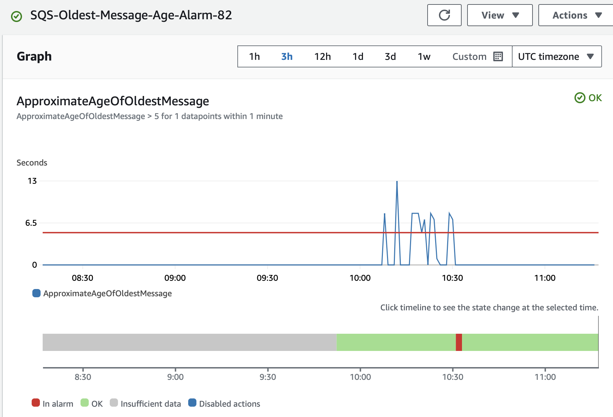

Skrivefeil !  Github repo heter PGR310 istedenfor PGR301

-----

### OPPGAVE 1
#### 1A
**HTTP-Endepunkt for Lambdafunkskonen som kan testes med Postman**:  
```Method: POST ```  
```Header: Content-Type: Application/json```  
```Body: JSON```  
```URL: https://by5lwd6wl8.execute-api.eu-west-1.amazonaws.com/Prod/generate-image ```

Bilde av et eksempel for body i postman:  


#### 1B 
**Lenke til en vellykket kjøring av GitHub Actions
workflow som har deployet SAM-applikasjonen til AWS**:  
https://github.com/JovanaSpasenic/PGR310_Exam/actions/runs/11900222819

---

### OPPGAVE 2 A og B

**Lenke til Github Actions Workflow (main)**:
https://github.com/JovanaSpasenic/PGR310_Exam/actions/runs/11900222818

**Lenke til Github Actions Workflow (Ikke main)**:
https://github.com/JovanaSpasenic/PGR310_Exam/actions/runs/11823989179

**Lenke til SQS-kø**:  
https://sqs.eu-west-1.amazonaws.com/244530008913/image-queue_82

---

### OPPGAVE 3 A og B

**Beskrivelse av taggestrategi**:

Jeg har valgt å tagge Docker-imagene med "latest", som representerer den nyeste stabile versjonen av applikasjonen. Denne strategien er valgt for å sikre at alle miljøer alltid bruker den nyeste versjonen av imaget uten behov for å spesifisere en konkret tag.

**Fordeler**:
- **Enkelhet**: Bruken av latest gjør det lettere å administrere bildene, da man alltid refererer til den nyeste versjonen av applikasjonen uten å måtte holde styr på spesifikke versjonsnummer.
- **Konsistens på tvers av miljøer**: Alle utviklings-, test- og produksjonsmiljøer vil automatisk bruke den nyeste versjonen av applikasjonen når latest-taggen er satt, noe som forenkler distribusjon og vedlikehold.
- **Rask distribusjon**: Ved å bruke latest kan man raskt rulle ut oppdateringer til alle miljøer uten å måtte oppdatere tags i flere konfigurasjonsfiler eller systemer.


**Container image + SQS URL**:

 ``` docker run -e AWS_ACCESS_KEY_ID=xxx -e AWS_SECRET_ACCESS_KEY=xxx -e SQS_QUEUE_URL="https://sqs.eu-west-1.amazonaws.com/244530008913/image-queue_82" jovanaspasenic/java_sqs_client:latest "me on top of a pyramid" ```


---

### OPPGAVE 4

- E-postadresse for varslinger -> Angi epost i ```terraform.tfvars```


##### For å utløse alarmen kan følgende metoder brukes:

- **Simulere køforsinkelse**:
Alarmen rekker ikke å utløses fordi Lambda-funksjonen prosesserer meldinger for raskt, og køen tømmes før meldingene blir eldre enn den definerte terskeln, f.eks. 30 sekunder. For å løse dette kan man konfiguerere **Visibilty Timeout** i SQS-køen.  Ved å sette ```visibility_timeout_seconds=60``` gir det en "hvileperiode" i køen, og alarmen kan lettere utløses under testing
- **Justere terskelverdien (thresold)**: 
	Alarmen trigges når eldste melding i køen er eldre enn verdien satt i threshold. For testing kan denne verdien reduseres til noe lavt for raskere trigging av alarmen. Jeg testet dette ved å sette ```threshold = 5```, og fikk en e-postvarsel om at alarmen ble utløst. Etter testing satte jeg verdien tilbake til en realistisk verdi på 30 sekunder.
- **Automatisere meldingssending**:
Ved å bruke en for-løkke i Bash kan man sende mange meldinger til SQS-køen uten å gjøre det manuelt. Dette skaper en høy belastning som kan hjelpe med å utløse alarmen, selv når terskelen er satt til 30 sekunder. For eksempel:

```	bash	
for i in {1..100}; do
		  aws sqs send-message --queue-url https://sqs.eu-west-1.amazonaws.com/244530008913/image-queue_82 --message-body "Test Message $i";
		done
```
**Resultat**: 
Under testingen observerte jeg en spike i CloudWatch-alarm grafen for SQS-køen. Alarmen gikk fra status ```OK``` til ```ALARM``` når terskelen ble overskredet. Jeg mottok også en bekreftelse på e-post om at alarmen var utløst.
	
Bilde av alarm som er utløst:  


---

### OPPGAVE 5 

**1. Automatisering og kontinuerlig levering (CI/CD)**: _Hvordan påvirker serverless-arkitektur
sammenlignet med mikrotjenestearkitektur CI/CD-pipelines, automatisering, og utrullingsstrategier?_

Implementering av DevOps-prinsipper som automatisering og kontinuerlig levering (CI/CD) påvirkes på ulike måter av serverless-arkitektur og mikrotjenestearkitektur, og begge tilnærmingene har sine styrker og svakheter. 

I en serverless-arkitektur, som ofte benytter tjenester som AWS Lambda, forenkles utrullingsprosessen betydelig. Dette skyldes at CI/CD-pipelines kan fokusere på å distribuere små, selvstendige funksjoner uten å måtte håndtere underliggende infrastruktur, siden dette administreres av skyleverandøren. Dette gjør det mulig å rulle ut hyppige og små oppdateringer raskt, med minimal risiko for å påvirke andre deler av systemet. Ved å bruke verktøy som AWS SAM (Serverless Application Model), som fungerer som et rammeverk for å definere og deployere serverless-applikasjoner, kan utviklere håndtere infrastrukturen som kode. Dette sikrer konsistens i prosessene og gjør det enklere å reprodusere miljøer i ulike faser av utviklingen. Samtidig gir plattformen automatisert skalering, noe som eliminerer behovet for manuell justering av ressurser i CI/CD-pipelines.

Likevel kan serverless-arkitektur introdusere utfordringer, særlig når systemet vokser og består av et stort antall funksjoner. Et slikt scenario kan kreve hyppige og komplekse distribusjoner, noe som medfører økt administrasjonsarbeid for pipelines. Avhengigheter mellom funksjoner og eksterne tjenester, som meldingskøer (f.eks. Amazon SQS), kan også komplisere oppsettet. Dessuten kan serverless-løsningers begrensede fleksibilitet når det gjelder utrullingsstrategier – for eksempel tilpassede strategier som blå/grønn-distribusjon eller kanarideployment – gjøre det vanskelig å implementere mer avanserte oppdateringsmetoder som gir bedre kontroll og redusert risiko.

På den andre siden har vi mikrotjenestearkitektur, som ofte er bygget ved hjelp av containere, og gir større kontroll over CI/CD-prosessene. Hver mikrotjeneste kan ha sin egen dedikerte pipeline, som gjør det enklere å isolere og teste endringer uten å påvirke andre deler av systemet. Mikrotjenester gir større fleksibilitet i valg av utrullingsstrategier, som blå/grønn-distribusjon og kanarideployment, som er lettere å implementere og tilpasse etter systemets behov. Ettersom mikrotjenester vanligvis kjøres på containerteknologier som Docker, eller på cloud-plattformer som ECS, innebærer dette høyere kompleksitet i infrastrukturen. Verktøy som Terraform kan være avgjørende i denne sammenhengen, ettersom det forenkler administrasjonen av containerbaserte tjenester ved å gjøre infrastrukturen forenklet og standardisert. Terraform muliggjør enklere oppsett og vedlikehold av mikrotjenesteinfrastrukturen, noe som gir fleksibilitet og redusert kompleksitet i systemadministrasjonen.

Likevel kommer mikrotjenestearkitekturen med sine egne utfordringer. CI/CD-pipelines for mikrotjenester må ofte håndtere kompleks infrastruktur, inkludert containerklustre og nettverksoppsett. Dette krever mer administrativ innsats både ved oppsett og drift, og kan medføre lengre byggetider og høyere ressursforbruk. Mikrotjenester krever ofte dedikerte ressurser, selv når de ikke er aktive, noe som kan føre til ineffektiv ressursbruk sammenlignet med serverless-arkitektur, hvor ressurser kun forbrukes når funksjoner kjøres.

Samlet sett gir serverless-arkitektur en enklere inngang til automatisering og kontinuerlig levering, med mindre fokus på infrastrukturhåndtering og raskere distribusjon av små funksjoner. Derimot krever den mer administrasjon av avhengigheter og har begrenset fleksibilitet ved større og mer komplekse systemer. Mikrotjenestearkitektur gir større kontroll over CI/CD-pipelines og mulighet for mer skreddersydde utrullingsstrategier, men krever samtidig mer arbeid med infrastruktur og kan være mindre effektiv i ressursforbruk. Bruken av verktøy som AWS SAM og Terraform kan derfor bidra til å balansere styrkene og svakhetene i begge tilnærmingene, avhengig av prosjektets behov og skaleringskrav.

**2. Observability (overvåkning)**:     
_Hvordan endres overvåkning, logging og feilsøking når man går fra
mikrotjenester til en serverless arkitektur? Hvilke utfordringer er spesifikke for observability i en FaaS-
arkitektur?_

Når man går fra mikrotjenester til en serverless arkitektur, endres tilnærmingen til overvåkning, logging og feilsøking betydelig. I en mikrotjenestearkitektur er hvert individuell tjeneste ofte lett å overvåke og feilsøke på grunn av den sentraliserte infrastrukturen. Mikrotjenester kjøres på dedikerte servere eller containere, og utviklerne har mer kontroll over hvordan applikasjonen kjører, noe som gjør det enklere å bruke tradisjonelle teknikker som loggfiler og serverovervåkning for å oppdage problemer.

I en serverless arkitektur, derimot, kjører applikasjonene som små funksjoner som er stateless og ofte distribuert på tvers av flere servere eller skytjenester, noe som gjør det vanskeligere å feilsøke og overvåke. Funksjonene er designet for å være raske og selvstendige, og kan aktiveres på etterspørsel. Dette kan føre til utfordringer som kalles "cold starts" (forsinkelse ved oppstart av funksjonene), og også at feilmeldinger kan være mer fragmenterte. Det er vanskeligere å få innsikt i helheten av systemet, ettersom funksjonene kan oppføre seg forskjellig ved hvert kjør, avhengig av ressursene de får tilgang til og miljøet de kjører i.

Feilsøking i en serverless arkitektur krever avanserte overvåknings- og logging-verktøy som kan gi innsikt i funksjonenes ytelse, feil og hendelser. Selv om mange cloud-leverandører tilbyr innebygde overvåkningsverktøy som AWS CloudWatch, kan disse verktøyene være utilstrekkelige for mer komplekse bruksområder, og det kan være nødvendig å bruke tredjeparts verktøy for å få mer detaljerte innsikter. Det kan også være utfordrende å spore avhengigheter mellom serverless-funksjoner og eksterne tjenester som API-er eller databaser, noe som krever spesialiserte verktøy for å sikre at eventuelle problemer raskt kan identifiseres og løses.

I en mikrotjenestearkitektur har utviklerne vanligvis full kontroll over loggene og har mulighet til å overvåke hele systemet gjennom sentraliserte loggtjenester. Dette gjør det lettere å identifisere problemer på tvers av mikrotjenester. I serverless miljøer er overvåkning mer distribuert, og funksjoner kan være vanskelige å spore, noe som krever mer sofistikerte teknikker for logging og overvåking for å få en helhetlig visning av applikasjonens "helse".

Sammenfattende kan man si at overgangen fra mikrotjenester til serverless arkitektur innebærer en økt kompleksitet i hvordan man håndterer overvåkning og feilsøking. Mens mikrotjenester gir større kontroll og mulighet for enklere debugging og logging, krever serverless arkitektur investering i avanserte verktøy for å håndtere de spesifikke utfordringene som oppstår fra det stateless og distribuerte naturen av funksjonene.

**3. Skalerbarhet og kostnadskontroll**:  
_Diskuter fordeler og ulemper med tanke på skalerbarhet,
ressursutnyttelse, og kostnadsoptimalisering i en serverless kontra mikrotjenestebasert arkitektur._

_Skalerbarhet_  
En av de mest kjente fordelene med serverless-arkitektur er dens automatiske skalerbarhet. I en serverless-modell, som for eksempel AWS Lambda, skaleres funksjonene automatisk basert på etterspørsel. Det betyr at dersom belastningen på systemet øker, håndteres dette automatisk av plattformen uten at utvikleren må gjøre noen justeringer. Dette gjør serverless ideelt for applikasjoner som har uforutsigbare trafikkmønstre, som for eksempel nettbaserte applikasjoner, event-drevne systemer eller periodiske belastninger som julehandel.

I motsetning til dette krever mikrotjenester en mer manuell tilnærming til skalerbarhet. Selv om det finnes verktøy som Kubernetes og Docker Swarm som kan håndtere automatisk skalering, må utviklerne ofte definere og konfigurere hvordan mikrotjenester skal skalere, hva som utløser skaleringen, og hvordan tjenestene kommuniserer med hverandre når de er skalert. Dette kan være mer komplekst og tidkrevende, spesielt i store applikasjoner med mange mikrotjenester som skal håndtere høy belastning.

_Ressursutnyttelse_  
Serverless arkitektur har en betydelig fordel når det gjelder ressursutnyttelse, da funksjonene kun er aktive når de kjører. Dette betyr at man bare betaler for de ressursene man faktisk bruker, som tid og prosessorkapasitet for hver funksjon som kjøres. Dette kan føre til svært effektiv ressursbruk, spesielt for applikasjoner med varierende belastning. Serverless fungerer også ved at funksjonene er stateless og kjøres kun når de er nødvendige, noe som reduserer behovet for å holde servere oppe og tilgjengelige hele tiden.

Mikrotjenester derimot, krever dedikerte ressurser, enten i form av virtuelle maskiner eller containere, som kan føre til lavere ressursutnyttelse i perioder med lav trafikk. Selv om containere kan administreres dynamisk, vil systemet fortsatt bruke ressurser på tjenestene som er tilgjengelige hele tiden, uavhengig av trafikkmønstrene. Dette kan føre til mer statiske og potensielt mindre effektive ressursbruksmodeller, spesielt i perioder med lav belastning.

_Kostnadsoptimalisering_  
Serverless er kostnadseffektivt ettersom man kun betaler for det man faktisk bruker, i stedet for å betale for ubenyttede ressurser. Dette kan være en stor fordel for applikasjoner med uforutsigbar eller periodisk trafikk, da man slipper å betale for overkapasitet. Serverless kan også redusere administrasjonskostnader, da mye av infrastrukturen håndteres av skyplattformen, slik at utviklingsteamet kan fokusere på kode og funksjonalitet.

En ulempe med serverless kan være at langvarige oppgaver, som for eksempel store dataoperasjoner, kan være dyrere eller vanskeligere å håndtere, da funksjonene kan ha tidsbegrensninger for hvor lenge de kan kjøre. Hvis applikasjonen har veldig høy og konstant trafikk, kan serverless også bli dyrere sammenlignet med mikrotjenester, da antall funksjonskall raskt kan øke kostnadene.

Mikrotjenester kan ha høyere faste kostnader fordi de krever at servere eller containere kjører kontinuerlig, selv når det er lite trafikk. Denne modellen kan være mer kostnadskrevende på lang sikt, spesielt for applikasjoner med jevn eller lav trafikk.

En annen kostnadsrelatert ulempe med mikrotjenester er administrasjon av infrastruktur, som kan innebære både personellkostnader og verktøy for å holde oversikt over tjenester og ressurser. Dette kan være dyrere enn serverless, der mye av infrastrukturen håndteres av skyplattformen.

**4. Eierskap og ansvar**:   
_Hvordan påvirkes DevOps-teamets eierskap og ansvar for applikasjonens
ytelse, pålitelighet og kostnader ved overgang til en serverless tilnærming sammenlignet med en
mikrotjeneste-tilnærming?_

_Ytelse_:  
I en mikrotjeneste-tilnærming er DevOps-teamet ansvarlig for å sikre at hver mikrotjeneste fungerer optimalt. Dette innebærer å overvåke ytelsen til individuelle tjenester, håndtere skalering, og sørge for at kommunikasjonen mellom tjenestene fungerer feilfritt. DevOps-teamet må implementere verktøy for logging, overvåkning og feilsøking på tvers av tjenestene, noe som kan være kompleks og tidkrevende.

Når man går over til en serverless arkitektur, får DevOps-teamet mindre kontroll over infrastrukturen, ettersom plattformen, som for eksempel AWS Lambda håndterer mye av skalering og tilgjengelighet automatisk. Teamet blir mer fokusert på å optimalisere funksjonene og koden, men må fortsatt overvåke og sikre at disse funksjonene fungerer effektivt, spesielt under høy trafikk eller høy belastning. Serverless plattformer kan tilby innebygde overvåkningsverktøy, men DevOps-teamet må fortsatt sørge for at applikasjonens ytelse ikke blir påvirket av eventuelle flaskehalser i funksjonene eller koden som kjøres.

_Pålitelighet_:  
I en mikrotjeneste arkitektur har DevOps-teamet fullt ansvar for å opprettholde påliteligheten til systemet. Dette innebærer å implementere redundans og feiltoleranse, overvåke statusen til hver mikrotjeneste, og håndtere eventuelle nedetider eller feil. DevOps-teamet må sørge for at hvert enkelt mikrotjeneste fungerer stabilt, og at eventuelle feil eller flaskehalser håndteres effektivt for å unngå systemfeil. De er også ansvarlige for å koordinere tjenestene på tvers av ulike systemer, noe som kan gjøre det utfordrende å sikre høy pålitelighet på tvers av hele applikasjonen.

Når man går over til en serverless arkitektur, blir mye av ansvaret for pålitelighet overlatt til skyplattformen som håndterer infrastrukturen. Serverless plattformer som AWS Lambda har innebygd redundans og feiltoleranse, og håndterer automatisk skalerbarhet og tilgjengelighet. DevOps-teamet får dermed en mer fokusert rolle, som innebærer å sørge for at funksjonene de implementerer, er optimalisert for høy tilgjengelighet og at eventuelle flaskehalser i funksjonene blir identifisert og adressert. Selv om serverless arkitektur kan gi høy pålitelighet, er det fortsatt nødvendig å overvåke applikasjonens ytelse og sørge for at den er tilpasset bruksbehovene.

_Kostnader_:  
Mikrotjenester innebærer kostnader knyttet til vedlikehold av infrastruktur, som servere, containere og virtuelle maskiner. DevOps-teamet har ansvaret for å administrere kapasiteten og skaleringen av disse ressursene, noe som kan være ressurskrevende, spesielt i perioder med lav eller uforutsigbar trafikk. Hvis tjenestene ikke er riktig konfigurert, kan dette føre til ineffektiv ressursutnyttelse og overflødige kostnader. For å kontrollere kostnadene må teamet kontinuerlig optimalisere kapasitetshåndtering og skalering, samt sikre at ressurser brukes effektivt.

Med serverless arkitektur betaler man kun for det faktiske forbruket av ressurser, noe som gir muligheten for kostnadsbesparelser, spesielt for applikasjoner med varierende eller lav trafikk. Dette gir DevOps-teamet en fleksibel kostnadsmodell, da de slipper å håndtere overkapasitet og vedlikeholde infrastrukturen kontinuerlig. Men serverless kan være kostbart for applikasjoner med konstant høy trafikk, da hyppige funksjonskall kan føre til høye kostnader. DevOps-teamet må derfor nøye overvåke bruken og forbruket av serverless-funksjoner for å unngå uforutsette kostnader. I tillegg må de vurdere om det er mer kostnadseffektivt å bruke serverless for langvarige oppgaver eller om det finnes mer hensiktsmessige alternativer.


**Kilder**: 
- Forelesninger fra DevOps
- https://www.ibm.com/blog/serverless-vs-microservices/#:~:text=Microservices%20architectures%20are%20often%20less,of%20infrastructure%20and%20other%20resources.
- https://www.chaossearch.io/blog/microservices-challenges-and-serverless-log-management
- https://tristiks.com/blog/serverless-architecture-computing/

----